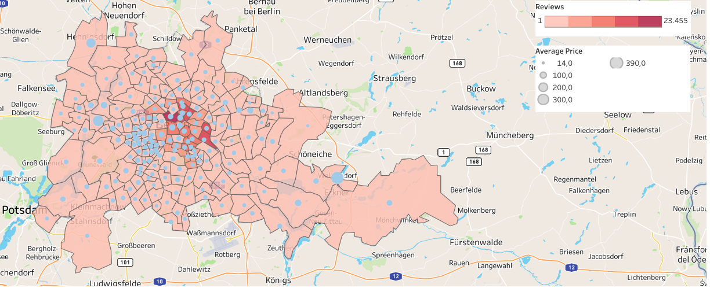

## Data Analyst Portfolio

---

### Projects

[Airbnb Berlin](https://public.tableau.com/views/AirbnbBerlin_17090407314950/AirbnbBerlin?:language=es-ES&:sid=&:display_count=n&:origin=viz_share_link)

Market research for the most well-known company for short-term housing rentals utilizing supervised and unsupervised machine learning algorithms and geospatial analysis with Python and Tableau.
The characteristics of this project required a deep understanding of Python and libraries such as Bokeh, Plotly, Dash, Folium, Geopandas, Geoplot, and scikit-learn. The scripts and visualizations created with Python are available for reference in a [GitHub repository](https://github.com/VaNuPe/Geospatial_Analysis_Project)
The development of this project was challenging and frustrating at times. Still, it is also an excellent example of the importance of cleaning and understanding the data as a starting point for every analysis.   

---
[Instacart](https://github.com/VaNuPe/Ecommerce_Buying_Patterns_Project)

For this project, I conducted all the stages of my analysis to identify the correlation between customer buying behavior and e-commerce marketing strategy with Python in Jupyter Notebook, using libraries such as Pandas, Numpy, Matplotlib, and Seaborn. 
One of the biggest challenges was the data set's size: more than 30 million rows. For some analysis and visualizations, I needed to sample the data to represent the entire population accurately.

---
[Influenza Season in the U.S.](https://public.tableau.com/views/RecommendationsfortheInfluenzaSeasoninU_S_/StaffPlan?:language=es-ES&:sid=&:display_count=n&:origin=viz_share_link)

The goal of this project was strategically assign key medical staff ahead of the flu season using Excel, VLOOKUP, and Tableau for data visualization. All the process and the corresponding analysis and findings are consolidated in an Interim Report available for consultation in a [GitHub Repository](https://github.com/VaNuPe/Staffing_Distribution), and the final storyboard is in Tableau Public.
The big challenge of this project was integrating the different available data sets into one, mainly because the values were not uniform.

---
[Rockbuster Stealth](https://github.com/VaNuPe/Market_Research_Project)

I conducted a market analysis to identify opportunities for a movie rental shop’s transition to an online service. I loaded all data into a relational database management system (RDBMS) to use SQL to analyze and answer ad-hoc business questions, from inventory to customer insights. To communicate my findings effectively, I transformed my SQL results into visualizations with [Tableau Public](https://public.tableau.com/views/RockbusterMarket/Story1?:language=es-ES&:sid=&:display_count=n&:origin=viz_share_link).

---
[GameCo](https://github.com/VaNuPe/Video_Game_Popularity)

An end-to-end analysis covering historical video game sales (1980-2016) to foster a better understanding of how a company's new games might fare in the market. I decided to run this analysis exclusively in Excel because the data set size was manageable, only 16,601 rows, and because it is a vital tool that a good analyst should be an expert in, too. The analysis and visualizations could be more impactful using Python or Tableau. Still, it is essential to have a solid understanding of this spreadsheet application and a working knowledge of its various formulas, functions, and data visualization capabilities. 

---

### Relevant Work Experience

**Machine Learning Data Associate**
Amazon Development Center Germany GmbH
_June 2017 to October 2023 (6 years, 4 months)_
- Supported the complete Natural Language Understanding pipeline of Alexa in Spanish and German to improve the understanding, the answers, and the text-to-speech of the devices. 
- Coordinated different workflows and verified processes, increasing the quality by up to 98%.
- Ramped new team members by preparing and delivering training and working sessions to ensure high quality since the onboarding. 
- Person of contact regarding privacy issues working with the data from customers. 

**Lecturer of Contemporary History**
Complutense University of Madrid
_July 2009 to July 2013 (4 years)_
- Sourced and analyzed thousands of documents archived in five countries with quantitative and qualitative methods and presented the results at international conferences and publications.  
- Coordinated seminars and conferences involving students and professors of different universities and research centers. 
- Reviewed articles and other documents before their publications, providing feedback to the authors and ensuring the quality of the texts. 
- Representative of the researchers in the Faculty Board. 

---

[Impressum](/pdf/Impressum.pdf)
